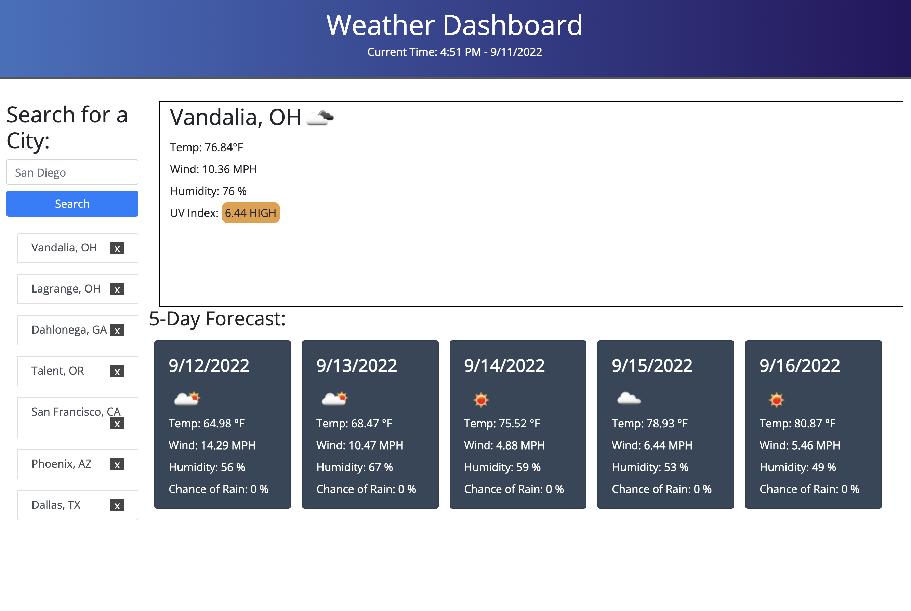
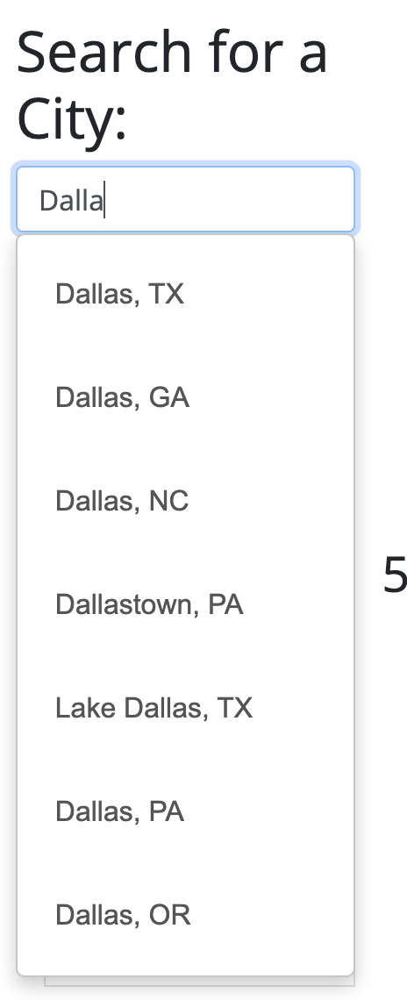
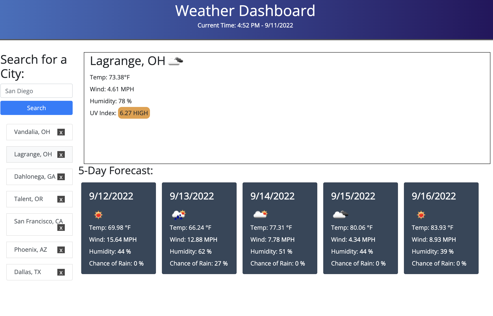

<!-- PROJECT LOGO -->
 

  

<h3 align="center">M6 Challenge</h3>

  

    a weather web application using html, css, javascript, jquery, bootstrap, moment js, and Open Weather Maps API.
     
     
    <a href="https://conradjohnson.github.io/m6-challenge" target="_blank">View Demo</a>
    ·
    <a href="https://github.com/conradjohnson/m6-challenge/issues">Report Bug</a>
    ·
    <a href="https://github.com/conradjohnson/m6-challenge/issues">Request Feature</a>
       
    Screen Grab 1: 
    
     
     
     
    Screen Grab 2: 
    
     
     
     
    Screen Grab 3: 
    
     
     
     
    
(<a href="#top">back to top</a>)

   
  

